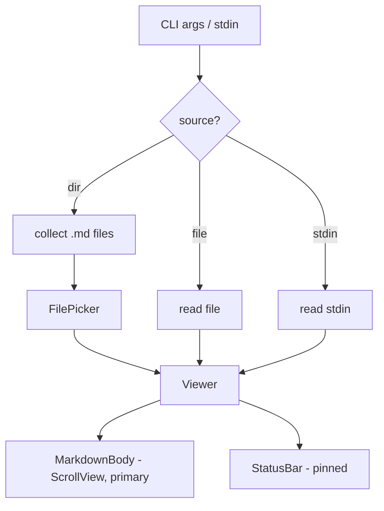

# mdview

A fast markdown terminal viewer built with
[@earendil-works/pi-tui](https://github.com/earendil-works/pi-mono/tree/main/packages/tui).
A lean, keyboard-driven alternative to [glow](https://github.com/charmbracelet/glow).

## Usage

```sh
bun run src/main.ts file.md        # view a file
bun run src/main.ts dir/           # browse markdown files in a directory
cat README.md | bun run src/main.ts # read from stdin
bun run src/main.ts                # no args in a TTY: browse cwd
```

Install as a CLI (Bun puts it on your PATH):

```sh
bun install -g .
mdview README.md
```

## Keys

| Key                          | Action                                |
| ---------------------------- | ------------------------------------- |
| `j`/`k`, arrows, mouse wheel | scroll                                |
| `d`/`u`, PgDn-ish            | scroll 10 lines                       |
| space                        | scroll 20 lines                       |
| `gg` / `G`                   | top / bottom                          |
| `h`/`l`, `n`/`p`             | prev / next file                      |
| `/`                          | search (built into pi-tui alt screen) |
| `o`                          | open file picker                      |
| `q`, `Esc`, `Ctrl+C`         | quit                                  |

## Architecture



## Configuration

`~/.config/mdview/config.json` (all optional):

```json
{
  "maxWidth": 100,
  "center": true,
  "paddingX": 1,
  "paddingY": 1,
  "statusBar": true
}
```

## Status

Lean core (v0.1.0): files, directory browsing, stdin, mouse scrolling and
selection from pi-tui's alt screen, pinned status bar with scroll position.

Ideas for later: GitHub URL fetching, TOC jump (`t`), image protocol support,
light/dark theme detection via OSC 11.
